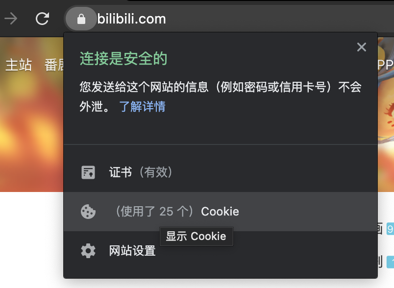
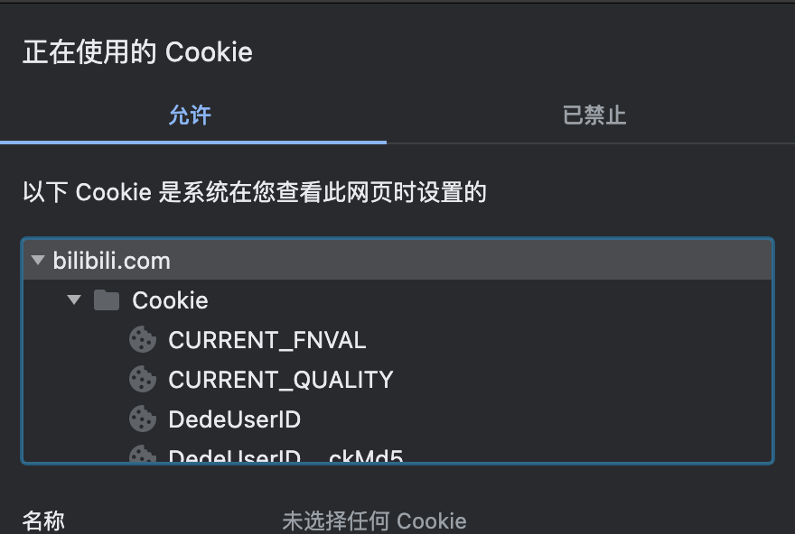

<div align="center">
<h1 align="center">
BILIBILI-DOWNLOADER
</h1>

[](https://github.com/duanfuqiang1128/bilibili-downloader/stargazers)
[](https://github.com/duanfuqiang1128/bilibili-downloader/network)
[](https://github.com/duanfuqiang1128/bilibili-downloader/issues)
[](https://github.com/duanfuqiang1128/bilibili-downloader)


</div>

# 工具简介

这是一个利用 Python 来自动下载和更新喜爱的b站up主的视频,简单配置即可上手使用。

**如果觉得好用,就顺手点个 Star 吧 ❤**

**仓库地址: [duanfuqiang1128/bilibili-downloader](https://github.com/duanfuqiang1128/bilibili-downloader)**

用到的第三方库：
- requests
- fire
- bilibili_api

## 功能列表

**请不要滥用相关API,让我们一起爱护B站 ❤**

# 快速开始

## 源码安装

### 安装python

[下载](https://www.python.org/downloads/release/python-379/)

### 下载程序

```shell script
git clone https://github.com/duanfuqiang1128/bilibili-downloader.git
```

### 安装依赖

```bash
pip install -r requirements.txt
# 使用清华源
pip install -i https://pypi.tuna.tsinghua.edu.cn/simple -r requirements.txt
```

### 开始使用

```shell script
python pontus.py COMMAND
```

## 基本使用
UID: 要跟踪up主的账号ID(UID/MID)

### 基本命令
`add UID`: 添加跟踪
`delete UID`: 取消跟踪
`show`: 显示所有跟踪的up主
`help`: 帮助
`update`: 更新视频

### 设置
**配置文件：config.json**
**使用前，需要设置数据库的绝对路径**

数据库路径：DATA_PATH

如何让程序可以抓取大会员专享高清视频？需要在配置文件中添加自己的大会员账号
#### 获取 SESSDATA 和 CSRF

这里以 **谷歌浏览器** 为例。

首先我们可以在链接栏左侧看到一个小锁，如果你没有使用HTTPS，那么可能会显示 `不安全` 的字样，点击以后，下面有个Cookies。



点开后，我们在下面找到以下两个键对应的值，分别是 **SESSDATA** 和 **bili_jct**，这里注意一下，**bili_jct 就是 CSRF **。




# 免责声明

1. 本工具不会上传任何敏感信息到任何服务器。(例如用户的cookies数据，cookies数据均存储在本地)
2. 本工具不会记录任何执行过程中来自B站的数据信息，也不会上传到任何服务器上。（例如av号，bv号，用户uid等）。
3. 本工具执行过程中产生的日志，不包含任何用户敏感信息，且只会在本地留存用于在出现问题时候的排查。
4. 如果有人修改本项目（或直接使用本项目）盈利，和我肯定没关系，开源的目的单纯是技术分享。
5. 如果你使用了第三方修改的，打包的本工具代码，请注意安全。
6. 本工具源码仅在[duanfuqiang1128/bilibili-downloader](https://github.com/duanfuqiang1128/bilibili-downloader)开源，其余的地方的代码均不是我提交的，可能是抄我的，借鉴我的，但绝对不是我发布的，出问题和我也没关系。 

# 致谢
感谢 JetBrains 对本项目的支持。

# API 参考列表

- **[Passkou/bilibili_api](https://github.com/Passkou/bilibili_api)**
